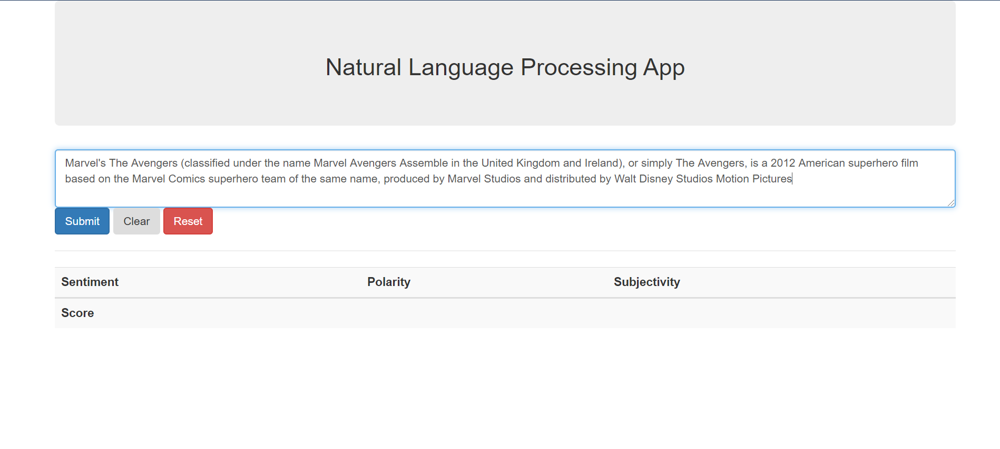
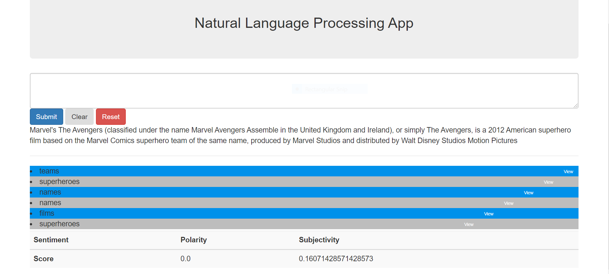

# NLPapp
NLP app which finds the noun from the given text and provides a link to view about it and secondly calculates the sentiment of the text by two parameters:polarity and subjectivity.  

# Screenshot 1: 
Enter the text in the textarea

# Screenshot 2: 
Results about the input text

